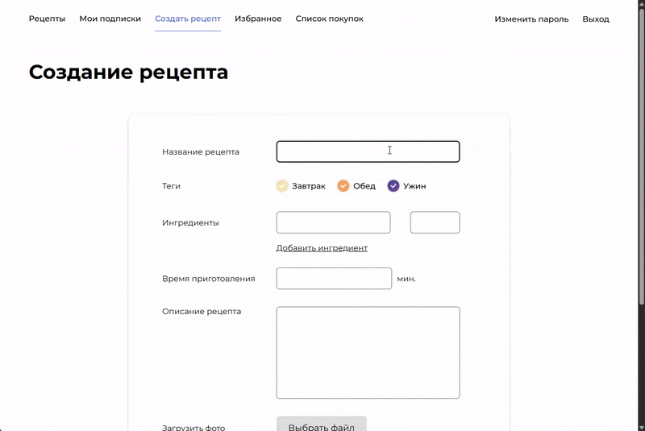

# Foodgram

 Продуктовый помощник - дипломный проект курса Backend-разработки Яндекс.Практикум. Проект представляет собой онлайн-сервис и API для него. На этом сервисе пользователи могут публиковать рецепты, подписываться на публикации других пользователей, добавлять понравившиеся рецепты в список «Избранное», а перед походом в магазин скачивать сводный список продуктов, необходимых для приготовления одного или нескольких выбранных блюд.

Проект реализован на `Django` и `DjangoRestFramework`. Доступ к данным реализован через API-интерфейс. Документация к API написана с использованием `Redoc`.

## Онлайн-демо
https://foodgram.kurkov.biz/

## Видео

## Особенности реализации

- Проект завернут в Docker-контейнеры;
- Образы foodgram_frontend и foodgram_backend запушены на DockerHub;
- Реализован workflow c автодеплоем на удаленный сервер и отправкой сообщения в Telegram;

## Развертывание проекта

### Развертывание на локальном сервере

1. Установите на сервере `docker` и `docker-compose`.
2. Создайте файл `/.env`. Шаблон для заполнения файла нахоится в `/.env.example`.
3. Выполните команду `docker compose up -d --buld`.
4. Выполните миграции `docker compose exec backend python manage.py migrate`.
5. Создайте суперюзера `docker compose exec backend python manage.py createsuperuser`.
6. Соберите статику `docker compose exec backend python manage.py collectstatic --no-input`.
7. Заполните базу ингредиентами `docker compose exec backend python manage.py load_ingredients`.
8. **Для корректного создания рецепта через фронт, надо создать пару тегов в базе через админку.**
9. Документация к API находится по адресу: <http://localhost/api/docs/redoc.html>.
